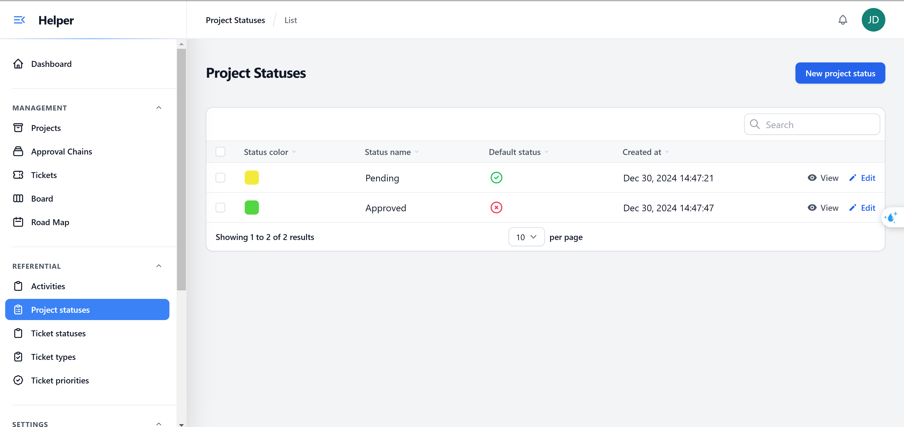
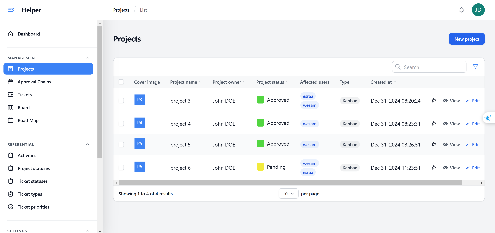
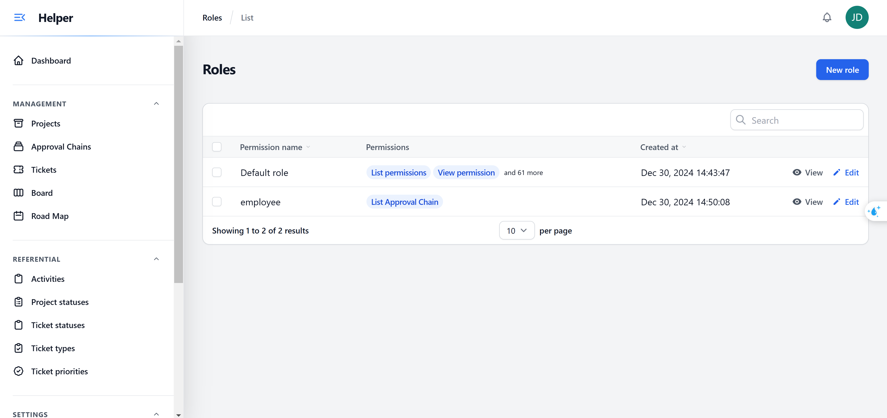
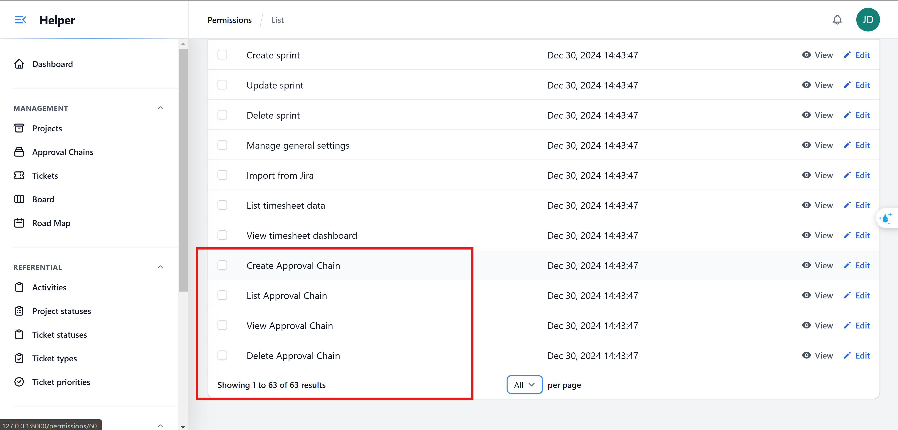
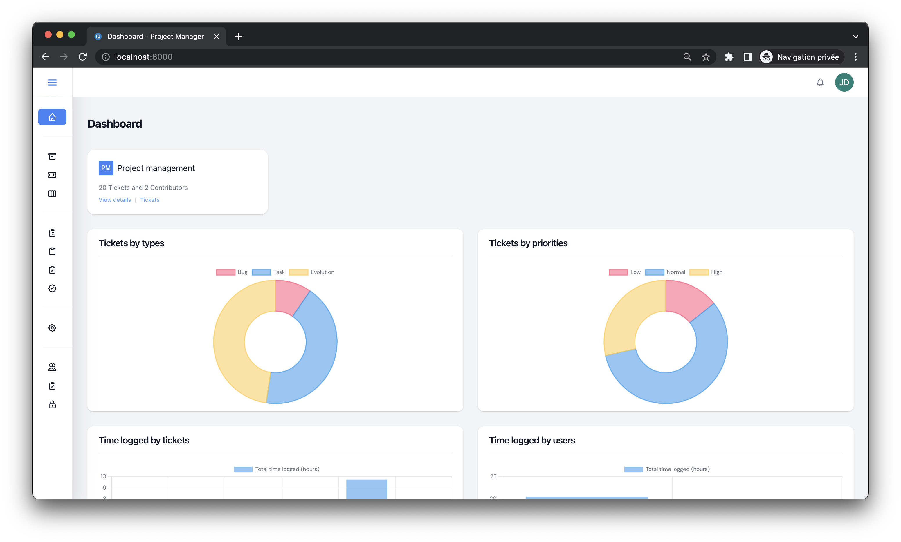
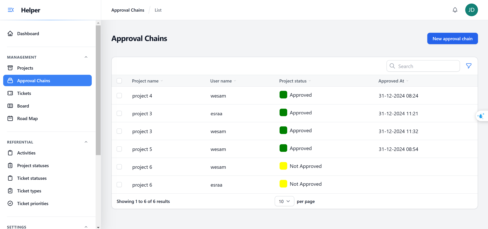

# Project Management

    
    
    
    
     
    
    
    
     
    
     
    

# Introduction

Approval Chain Management , This repository contains tasks for managing the Approval Chain with integration between Front-End and Back-End.

## Features

Approve and Forward: Allows users to approve steps in the approval chain.
Front-End and Back-End Interaction: The Front-End displays data and sends approval requests via an API.
Automatic Project Status Update: If all steps are approved, the project's status is updated.

## Screenshots

    </img> 
    </img> 
    </img> 
    </img> 
    </img> 
    </img> 
    </img> 
   

### Thanks to anyone who helps make this project better :heart:

### Notes
Ensure that the steps follow the correct order (step_order).
When sending approval, make sure the user has permission to approve the step.

## Sponsors

    
    

## Contributors

    
    
    
    
    

## Support us

